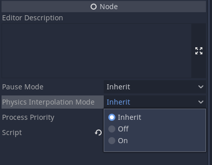

# 2D Physics Interpolation (preliminary docs)

In general everything in the existing docs applies, make sure to read the "quick start guide" if you are new to physics interpolation:

https://docs.godotengine.org/en/3.6/tutorials/physics/interpolation/index.html

As such I will mainly discuss differences that are specific to 2D.

## Global versus Local interpolation
* In 3D, physics interpolation is performed **independently** on the *global transform* of each 3D instance.
* In 2D by contrast, physics interpolation is performed on the *local transform* of each 2D instance.

This has some implications:
* In 3D, it is easy to turn interpolation on and off at the level of each `Spatial`, via the `physics_interpolation_mode` property in the Inspector, which can be set to `ON`, `OFF`, or `INHERITED`.
* However this means that in 3D, pivots that occur in the scene tree (due to parent child relationships) can only be approximately interpolated over the physics tick. In most cases this will not matter, but in some situations the interpolation can look slightly "off".
* In 2D, interpolated local transforms are passed down to children during rendering. This means that if a parent is set to `physics_interpolation_mode` `ON`, but the child is set to `OFF`, the child will still be interpolated if the parent is moving. _Only the child local transform is uninterpolated._
Controlling the on / off behaviour of 2D nodes therefore requires a little more thought and planning.
* On the positive side, pivot behaviour in the scene tree is perfectly preserved during interpolation in 2D, which gives super smooth behaviour.

## reset_physics_interpolation()
Whenever objects are moved to a completely new position, and interpolation is not desired (so as to prevent a `streaking` artefact), it is the responsibility of the user to call `reset_physics_interpolation()`.
The good news is that in 2D, this is automatically done for you when nodes first enter the tree. This reduces boiler plate, and changes required to get an existing project working. Note that if you move objects _after_ adding to the scene tree, you will still need to call `reset_physics_interpolation()` as with 3D.

## get_global_transform_interpolated()
This is not yet implemented for 2D. This means that manual camera handling will be more difficult. Depending on feedback from betas we will decide how / whether to improve this use case in 2D.

## CPUParticles2D
CPU particles are fully supported by physics interpolation. The only advanced feature still missing is the "streaking" option present in CPUParticles3D, which enables particles to emit _between_ physics ticks. For now it is recommended to use a physics tick rate of at least 20-30 ticks per second to keep particles looking good.

## MultiMesh2D
MultiMesh should be supported as with MultiMesh3D.

## Particles2D (GPU Particles)
GPU Particles are not yet supported. They will currently give glitchy behaviour when using physics interpolation.
For now users are recommended to convert to CPUParticles (but keep a backup of your GPUParticles for if we get these working).

## Bugs
As the 2D physics interpolation is very new, bugs are expected, please report these on github so we can iron them out.
