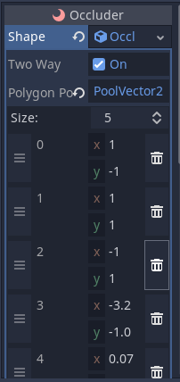
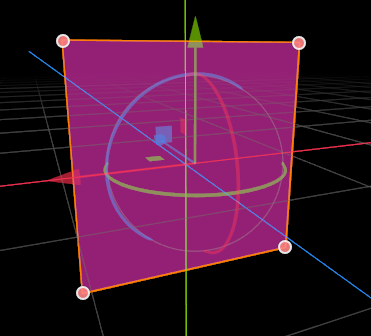
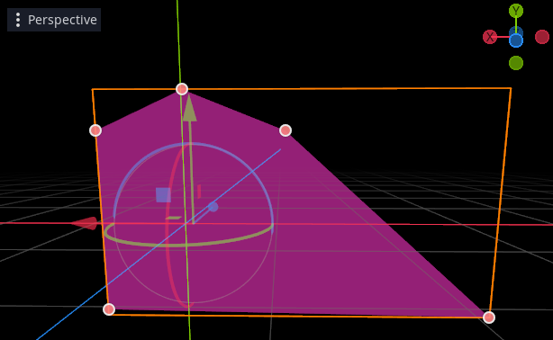
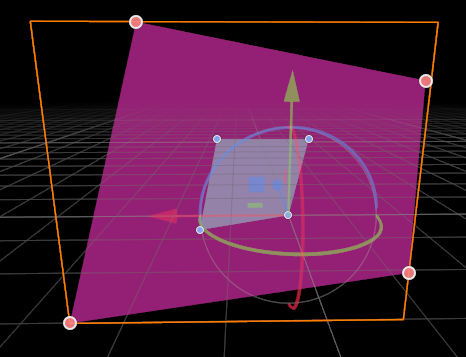

## OccluderShapePolygon
The polygon occluder is a generalist, it can be made to work well in almost all situations, and can quickly provide a degree of occlusion culling to most game levels.

As with all geometric occluders, the key to success is to make them large. They do not have to match rendered geometry, and in many cases they will work better if you extend them past rendered geometry to make them as big as possible, without blocking legitimate lines of sight in other areas. The reason why they need to be large is that in general, they will only cull objects whose AABB is completely hidden by the polygon. For large objects to be culled, you need large occluders.
Note that like all occluders they *can* overlap, and in many cases they will work better if you overlap them (they are more likely to catch objects on boundaries).

### Editing and details
Occluder polygons are edited as a list of points which define a _convex_ polygon, on a single plane. In order to confine the polygon to a single plane, the points are defined in 2D rather than 3D. The orientation and position of the polygon is taken instead from the transform of the Occluder Node.

If you create an Occluder and add to it a OccluderShapePolygon resource, by default it will create 4 starting points forming a rectangle. If you move the position and rotation of the Occluder Node you will see how the rectangle follows the node. When the Occluder is selected in the editor, handles will appear for each of the points. You can actually click and drag these handles, to match your polygon to the environment of your scene.

You are not restricted to 4 points, you can create many points, but note that:
* The editor will automatically sanitize your points to form a convex polygon. If you drag a point into a position that would form a concave polygon, it will be ignored.
* In general, the less edges (and thus points), the faster the polygon will work at runtime. A polygon with 6 edges will have to make twice the calculations of a polygon with 3 edges. In most cases 4 is a good number.

### Holes
Real world game levels don't always have large continuous areas that should be occluded. Often walls will have a door or windows, caves will have an entrance, etc. In some cases we have to make do by placing several Occluder polgons around such an opening, but Occluder polygons have one more trick up their sleeve - they can have "holes".

In the inspector you will notice that as well as a set of points for the polygon, the polgon has a set of points for a single "hole". If you add 3 or 4 to your polygon, you will see they appear in the editor as smaller handles. You can drag these around just like the polygon handles, to form a convex hole.

The hole can be totally within the polygon (such as a window), abutting the edge (like a door) or crossing the edge of the polygon completely. The way the hole works is that the culling follows a simple rule:
* If the object to be culled is totally hidden by the polygon, it then looks to see whether it can be seen _through_ the hole. If the object touches the hole, it is not culled, but if hidden by the polygon and not seen through the hole it is culled.

Placing holes is usually far more convenient, and works faster and better at runtime, than creating lots of smaller Occluder polygons.

### Hole Limits
The main limitation of holes is that there can only be one per polygon. If you have a situation which requires two or more holes, you have a choice:
* Combine the area of the two holes into one bigger hole (if they are close together).
* Use two or more OccluderPolygons.

Remember if using more than one polygon, they are allowed to overlap, and you should use this to your advantage.

### How many Occluder polys are needed?
This very much depends on your game level, but generally you can start getting a good benefit from 3 or 4 well placed polygons. After that it is totally up to you how much time you want to spend.
Placing occluders is a bit of an art form, and you will get better at it and learn new tricks the more you work with them.

Some ideas:
* Build your levels to take advantage of occlusion.
This is one of the secrets of the pros. A good level design is not just about what the gameplay demands, it should also be built with occlusion in mind.
* When in a building with multiple floors, place an occluder polygons between each floor, with a hole for where the staircase transitions between them. This can potentially cull out entire floors and greatly improve performance.
* Don't be afraid to extend your occluder polygons far past where they need to go to catch more objects - for instance far into the ground or sky

### Using Occluder polygons dynamically
Like all geometric occluders, polygons are not just for use on static (non-moving) geometry. You can place them on moving objects. You can even change the relative position of the points in realtime.

Some guidelines:
* There is a slight cost to moving polygons, the points of the polygons must be transformed on the CPU each time their transform changes.

This is not something to worry excessively about, even CPUs are reasonably fast at transforming points, and generally polygons have very few points compared to rendered geometry. But it is something to consider, if you wanted to create e.g. 10,000 simultaneous spaceships all with occluder polys.

* Changing the transform of the polygon Node (e.g. by moving the parent object) is cheaper than changing the points themselves, use the former rather than the latter wherever possible.
