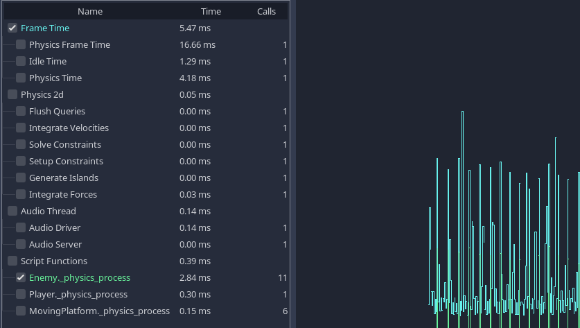

# CPU Optimization

## Measuring Performance
In order to know how to speed up our program, we have to know where the 'bottlenecks' are, the slowest parts that are limiting the rate that everything can progress. This allows us to concentrate our efforts on optimizing the areas which will give us the greatest speed improvement, instead of spending a lot of time optimizing functions that will lead to little if any improvement to performance.

For the CPU, the easiest way to identify bottlenecks is to use a profiler.

## CPU Profilers

Profilers run alongside your program as it runs, and take timing measurements in order to work out what proportion of time is spent in each function.

Godot IDE conveniently has a built in profiler. It does not run every time you start your project, and must be manually started and stopped. This is because, in common with most profilers, recording these timing measurements can slow down your project.

After profiling, you can look back at the results for a frame.



_These are the results of a profile of one of the demo projects._

Note that we can see the cost of in built processes such as physics and audio, as well as seeing the cost of our own scripting functions at the bottom.

When a project is running slowly, you will often see an obvious function or process taking a lot more time than others. This is your primary bottleneck, and you can usually increase speed by optimizing this area.

## External Profilers

Although the Godot IDE profiler is very convenient and useful, sometimes you need more power, and the ability to profile the Godot engine source code itself.

You can use a number of third party profilers to do this, often free, including Valgrind, VerySleepy, Visual Studio and Intel VTune. Note that in order to use a third party profiler, you may need to compile the Godot engine from source, in order to have program database information available for the profiler. You can also use a debug build, however, note that the results of profiling a debug build will be different to a release build, because of optimizations in the latter. Simply put, bottlenecks are often in a different place in debug builds, so profiling release builds should be the gold standard.


_These are example results from Callgrind, part of Valgrind, on Linux._

From the left, Callgrind is listing the percentage of time within a function and its children (Inclusive), the percentage of time spent within the function itself, excluding child functions (Self), the number of times the function is called, the function name, and the file or module.

In this example we can see nearly all time is spent under the `Main::iteration()` function, this is the master function in the Godot source code that is called repeatedly, and causes frames to be drawn, physics ticks to be simulated, and nodes and scripts to be updated. A large proportion of the time is spent in the functions to render a canvas (66%), because in this example I was running a 2d benchmark. Below this we see that almost 50% of the time is spent outside Godot code in `libglapi`, and `i965_dri` (the graphics driver). This tells us the a large proportion of the time is being spent in the graphics driver.

This is actually an excellent example because in an ideal world, only a very small proportion of time would be spent in the graphics driver, and this is an indication that there is a problem with too much communication and work being done in the graphics API. This profiling lead to the development of 2d batching, which greatly speeds up 2d by reducing bottlenecks in this area.

## Manually timing functions
Another handy technique, especially once you have identified the bottleneck using a profiler, is to manually time the function or area under test. The specifics vary according to language, but in pseudocode, you would do the following:

```
var time_start = get_time()
...
... your_function
...
var time_end = get_time()
print("Function took " + (time_end - time_start)) 
```
I have deliberately left out the time units here, as this will vary.

When manually timing functions, it is usually a good idea to run the function many times (say 1000 or more times), instead of just once (unless it is a very slow function). A large part of the reason for this is that timers often have limited accuracy, and CPUs will schedule processes in a haphazard manner, so an average over a series of runs is more accurate than a single measurement.

As you attempt to optimize functions, be sure to either repeatedly profile or time them as you go. This will give you crucial feedback as to whether the optimization is working (or not).

## Caches

Something else to be particularly aware of, especially when comparing timing results of two different versions of a function, is that the results can be highly dependent on whether the data is in the CPU cache or not. CPUs don't load data directly from main memory, because although main memory can be huge (many GBs), it is very slow to access. Instead CPUs load data from a smaller, higher speed bank of memory, called cache. Loading data from cache is super fast, but every time you try and load a memory address that is not stored in cache, the cache must make a trip to main memory and slowly load in some data. This delay can result in the CPU sitting around idle for a long time, and is referred to as a 'cache miss'.

This means that the first time you run a function, it may run slowly, because the data is not in cache. The second and later times, it may run much faster because the data is in cache. So always use averages when timing, and be aware of the effects of cache.

Understanding cache is also crucial to CPU optimization. If you have an algorithm (routine) that loads small bits of data from randomly spread out areas of main memory, this can result in a lot of cache misses, a lot of the time, the CPU will be waiting around for data to operate on instead of doing any work. Instead, if you can make your data accesses localised, or even better, access memory in a linear fashion (like a continuous list), then the cache will work optimally and the CPU will be able to work as fast as possible.

## Languages
Godot supports a number of different languages, and it is worth bearing in mind that there are tradeoffs involved - some are designed for ease of use, at the cost of speed, and others are faster but more difficult to work with.

Calculations made 'Godot side' (i.e. in Godot engine code) will tend to be fast, however, if your project is making a lot of calculations in its own code, it is worth considering whether part of it could be moved to a more performant language.

### GDScript
GDScript is designed to be easy to use and iterate, and is ideal for making many types of game. However, ease of use is considered more important than performance, so if you need to make heavy calculations, consider moving some of your project to one of the other languages.

### C#
C# is popular and has first class support in Godot. It offers a good compromise between speed and ease of use.

### Other languages
Third parties provide support for several other languages, including rust and javascript.

### c++
c++ is the language Godot engine is written in. It will usually result in the fastest code, however, on a practical level, it is the most difficult to deploy to end users machines on different platforms. Options for using c++ include gdnative, and modules.

## Threads
Often an option when a lot of calculations need to be made, or a lot of different calculations in parallel, is to utilize threads. Modern CPUs have multiple cores, each one capable of doing a limited amount of work. By spreading work over multiple threads we can move further towards peak CPU efficiency.

The disadvantage is you have to be incredibly careful using threads. As each CPU core operates independently, they can end up trying to access the same memory at the same time. One thread can be reading to a variable while another is writing. Before you use threads make sure you understand the dangers and how to try and prevent these race conditions.

## SceneTree
Although scene tree nodes are an incredibly powerful and versatile concept, be aware that every node has a cost. Built in functions such as `_process` and `_physics_process` (and many others) propagate through the tree. This housekeeping can lead to pathological situations when you have very large numbers of nodes.

Also consider that each node is handled individually in the Godot renderers, sometimes a smaller number of nodes with more in each can lead to better performance.

One quirk of the scenetree is that you can sometimes get much better performance by removing nodes from the scene tree, rather than by pausing or hiding them. You might not choose to delete a detached node. You can for example, keep a reference to a node, detach it from the scene tree, then reattach it later. This can be very useful for adding and removing areas from a game.

## Physics
In some situations physics can end up becoming a bottleneck, particularly with complex worlds, and large numbers of physics objects. Some great techniques are to use simplified versions of your rendered geometry for physics. Often this won't be noticable for end users, but can greatly increase performance.

Other techniques can include removing objects from physics when they are out of view / outside the current area, or reusing physics objects (maybe you allow 8 monsters per area, for example, and reuse these).

Another crucial aspect to physics is the physics tick rate. In some games you can greatly reduce the tick rate, and instead of for example, updating physics 60 times per second, you may update it at 20, or even 10 ticks per second. This can greatly reduce the CPU load.

The downside of changing physics tick rate is you can get jerky movement or jitter when the physics update rate does not match the frames rendered. The solution to this problem is 'fixed timestep interpolation', which involves smoothing the rendered positions and rotations over multiple frames to match the physics. You can either implement this yourself or use a thirdparty addon. Interpolation is a very cheap operation, performance wise, compared to running a physics tick, orders of magnitude faster, so this can be a significant win, as well as reducing jitter.
