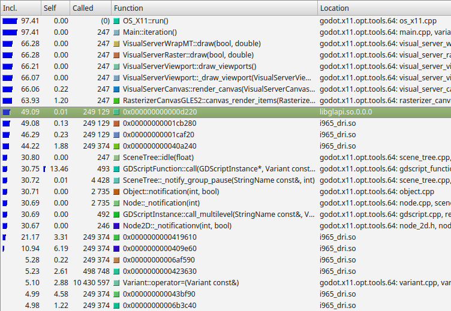

# CPU Optimization

## CPU Profilers
In order to know how to speed up our program, we have to know where the 'bottlenecks' are, the slowest parts that are limiting the rate that everything can progress. This allows us to concentrate our efforts on optimizing the areas which will give us the greatest speed improvement, instead of spending a lot of time optimizing functions that will lead to little if any improvement to performance.

Bottlenecks are easy to identify with perhaps the most important tool in any optimizers bag of tricks - the profiler. Profilers run alongside your program, and as your program runs, they take timing measurements in order to work out what proportion of time is spent in different functions.

The kind of results you will be looking for are illustrated on this diagram (from callgrind, a profiler for linux):

From the left, it is listing the percentage of time within a function and its children (Inclusive), the percentage of time spent within the function itself, excluding child functions (Self), the number of times the function is called, the function name, and the file.

In this example we can see nearly all time is spent under the `Main::iteration()` function, this is the master function in the Godot source code that is called repeatedly, and causes frames to be drawn, physics ticks to be simulated, and nodes and scripts to be updated. A large proportion of the time is spent in the functions to render a canvas (66%), because in this example I was running a 2d benchmark. Below this we see that almost 50% of the time is spent outside Godot code in `libglapi`, and `i965_dri` (the graphics driver). This tells us the a large proportion of the time is being spent in the graphics driver.

This is actually an excellent example because in an ideal world, only a very small proportion of time would be spent in the graphics driver, and this is an indication that there is a problem with too much communication and work being done in the graphics API. This profiling lead to the development of 2d batching, which greatly speeds up 2d by reducing bottlenecks in this area.

The easiest way to get started with profiling is to use the profiler in built in the Godot IDE. This is an ideal way to find out, for example, what part of your gdscript may be slowing down your project. As well as letting you know how much time is spent in various functions, Godot IDE also features various monitors which can help you track down performance problems.

GODOT PROFILER PICTURE

When you need more information than Godot profiler provides, there a number of third party profilers that can be used profile the Godot source code itself, although they will usually require a specially compiled version of Godot including some program database information that can be used to track line numbers (either a debug build or a release without program database stripped). Note that bottlnecks can be quite different in debug and release builds. Profiling debug builds can give approximate information, but release builds will be the gold standard, because compiler optimizations can drastically change the relative cost of different areas.

## SceneTree

## GDScript

## c++

## Physics

## Threads

## SIMD

