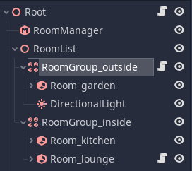

### Rooms and Portals
# Advanced
## Gameplay Callbacks
Although occlusion culling greatly reduces the number of objects that need to be rendered, there are other costs to maintaining objects in a game besides the final rendering. For instance, did you know that in Godot, animated objects will still be animated whether they appear on screen or not! This can take up a lot of processing power, especially for objects that use software skinning (where skinning is calculated on the CPU).

Fear not, rooms and portals can solve these problems, and more.

By building our system of rooms for our game level, not only do we have the information needed for occlusion culling, we also have handily created the information required to know which rooms are in the local 'gameplay area' of the player (or camera). If you think about it, in a lot of cases, there is no need to do a lot of simulation on objects that have nothing to do with gameplay.

The gameplay area is not confined to just the objects you can see in front of you. AI monsters behind you still need to attack you when your back is turned! In Godot the gameplay area is defined as the `potentially visible set` (PVS) of rooms, from the room you are currently within. That is, if there is any part of a room that can possibly be viewed from any part of the room you are in (even from a corner), it is considered within the PVS, and hence the gameplay area.

This works because if a monster is in an area that is completely out of view for yourself or the monster, you are less likely to care what it is doing.

### How does a monster know whether it is within the gameplay area?
This problem is solved because the portal system contains a subsystem called the `gameplay monitor` that can be turned on and off from the `RoomManager`. When switched on, any roaming objects that move inside or outside the gameplay area (whether by moving themselves, or the player moving) will receive callbacks to let them know of this change.

You can choose to either receive these callbacks as `signals`, or as `notifications`.

Notifications can be handled e.g. in gdscript:
```
func _notification(what):
	match what:
		NOTIFICATION_ENTER_GAMEPLAY:
			print("notification enter gameplay")
		NOTIFICATION_EXIT_GAMEPLAY:
			print("notification exit gameplay")
```

Signals are sent just as any other signal, they can be attached to functions using the Editor Inspector. The signals are called `gameplay_entered` and `gameplay_exited`.

In fact, you don't just receive these callbacks for ROAMING objects. In addition Rooms and RoomGroups (which can be used to form groups of rooms) can also receive callbacks. You can use this to e.g. trigger AI behaviour when the player reaches certain points in a level. There are no rules, it is up to you.

## VisbilityNotifiers / VisibilityEnablers
Gameplay callbacks have one more useful function. By default in Godot animation and physics are still processed regardless of whether an object is within view. This can sap performance, especially when using software skinning.

The engine's solution to this problem is the `VisibilityNotifier` node, and its slightly easier to use variation, the `VisibilityEnabler` node. `VisibilityEnabler` can be used to switch off animation and sleep physics when an object is outside the view frustum. You do this by simply placing a `VisibilityEnabler` node in your subscene (for e.g. a monster). It will do the rest. Consult the `VisibilityEnabler` documentation for full details.


What if the `VisibilityEnabler` could turn off objects when they were occlusion culled? Well it turns out they can. All you have to do is switch on the `Gameplay Monitor` and the rest happens automatically.

## RoomGroups
A `RoomGroup` is a special node which allows you to deal with a group of `Rooms`s at once, instead of having write code for them individually. This is especially useful in conjunction with gameplay callbacks. The most important use for `RoomGroup`s is to delineate between 'inside' and 'outside' areas.



For instance, when outside you may wish to use a directional light to represent the sun. When the outside `RoomGroup` receives an enter gameplay callback, you can turn the light on, and you can turn it off when the `RoomGroup` exits gameplay. With the light off, performance will increase as there is no need to render it indoors.

This is an example of a simple `RoomGroup` script to turn on and off a `DirectionalLight` (note that you can also use signals for callbacks, the choice is up to you) :


You can apply the same technique for switching on and off rain effects, skyboxes and much more.

## Internal Rooms
There is one more trick that RoomGroups have up their sleeve. A very common desire is to have a game level with a mixed outdoor and indoor environment. We have already mentioned that Rooms can be used to represent both rooms in a building, and areas of landscape, such as a canyon.

What happens if you wish to have a house in a terrain 'room'?

With the functionality described so far you _can_ do it, you would need to place portals around the exterior of the house though, forming needless rooms above the house. This has been done in many games. But what if there was a simpler way?

It turns out there is a simpler way of handling this scenario. Godot supports rooms WITHIN rooms (we will call them 'internal rooms'). That is, you can place a house within a terrain room, or even a building, or set of buildings, and even have exit portals in different terrain rooms!

This is actually very simple to do. You don't need to place a room within another room in the scene tree (in fact you will get a warning if you try this). Instead, just create them as regular rooms. But the internal rooms should be grouped together with a `RoomGroup` as parent. If you look in the inspector for the `RoomGroup` there is a `roomgroup_priority` which defaults to 0.

If you want a room or set of rooms to be internal, just set the priority to a higher value than the outer (enclosing) room, using the `RoomGroup`. That's all there is to it.

The system uses the priority to give priority to the internal room when deciding which room a camera or object is within. Everything else works in a mostly similar way.

The only differences:
* Portals between internal rooms and outer rooms should always __be placed in the inner (internal) room__
* Portals of internal rooms are not considered as part of the bound of outer rooms
* STATIC and DYNAMIC Objects from outer rooms will not sprawl into internal rooms. If you want objects to cross these portals, place them in the internal room. This is to prevent large objects like terrain sections sprawling into entire buildings, and rendering when not necessary.

