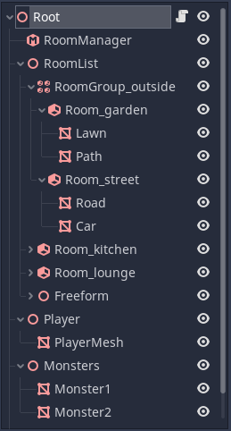
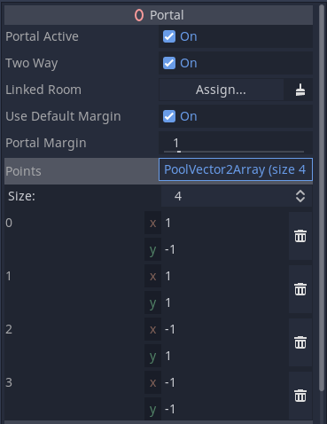
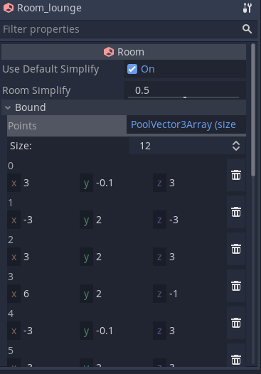

### Rooms and Portals
# Appendix
## Example SceneTree

## Creating Room systems in Blender (or other modeling tools)
Although you can create your room system entirely within the editor, you can also build rooms and portals within your modeling tool. There is one small snag - modeling tools such as Blender have no knowledge of `Room`, `RoomGroup` and `Portal` nodes. In order to work around this we use the naming conventions that were discussed earlier.

Rooms should be created as Empties with names such as `Room_kitchen` (substituting your preferred room name). If you place meshes within the rooms within the modeling tool, these Empties will form `Spatial` nodes in Godot, and will be converted to `Room` nodes automatically during the room conversion phase.

Creating a `RoomGroup` is easy - any Empty with the name prefix 'RoomGroup' will be converted to a `RoomGroup`.

#### Creating Portals in modeling tools
`Portal`s also use the same naming convention as within Godot - the name should start with the prefix `Portal_` followed by the name of the room the portal should link to. However, for `Portal`s, we want to specify the shape and position of the polygon within the modeling tool, so the nodes should be Meshes rather than Empties.

`Portal` meshes have some restrictions to work properly. They should be convex, and the polygon points should be in the same plane. The accuracy to the plane does not have to be exact, as Godot will automatically average the direction of the portal plane. Once converted to a `Portal` node, the snapping to the portal plane is enforced, and the vertices are specified (and editable) as 2d coordinates in the inspector, rather than 3d points.

## Portal Point Editing
Portals are defined by a combination of the transform of the Portal node, and by a set of points which form the corners.

The default portal has 4 corners as shown in the inspector:

You can edit these points in the inspector to make a better match to the opening in your game level. But bear in mind it generally better to keep the number of points as low as possible for the efficiency of the system. It is better to risk rendering a little too much than to spend the time culling objects at 20 different edges, for example.

## Room Point Editing
You also have the option to manually edit the points used to define the convex hull of a `Room`. These points are not present by default, you would typically create them by pressing the `Generate Points` button in the editor, when a Room is selected. This will transfer the auto bound from the geometry (or manual `Bound_` mesh) into the inspector. Once there are points in the inspector, they will be used and override any other method. So if you wish to revert your manual editing, simply delete all the points.

Manually editing rooms points is more difficult than editing portal points, but it can be useful in some situations, especially where the auto-bound doesn't _quite_ get the right result you want. It is usually a good idea to use a lot of `simplification` in the inspector for the Room before generating the points (be aware though that by default, the `simplification` value will be inherited from the `RoomManager`).

## RoomManager
#### Show Debug
This can be used to turn on and off display of portals in the editor, and control the amount of logging. Debug will always be set to false on exported projects.
#### Debug Sprawl
This mode will only display meshes that are sprawling through portals from the current camera room. Large statics that cross portals are usually the ones you want to sprawl. Typical examples might be terrain mesh areas, or large floor or ceiling meshes. You usually don't want things like door frames to sprawl to the adjacent room - that is what fine tuning the `Portal margin` is for.
#### Merge Meshes
In order to keep drawcalls to a minimum, the system offers the option to automatically merge similar meshes within a room. This can increase performance in many cases. The culling accuracy is reduced, but as a room is a fairly logical unit for culling, this trade off usually works in your favour.
#### Plane Simplification
In some cases, automatically generated convex hull bounds may contain a very large number of planes. This is not ideal because it slows down determining which room a camera or object is within. The system can optionally simplify hulls. The degree of simplification can be selected by the user, between 0 (no simplification) and 1 (maximum simplification). You can also override this value in individual rooms.

## Portals
#### Portal Active
Portals can be turned on and off at runtime. This is especially useful if you have open and closing doors.
#### Two Way
Portals can either be two way or one way. One way portals may be useful for example to create windows that can be seen out of, but not seen into. This can help performance when viewing buildings from outdoors.

### Particle Systems
Be aware that when placing STATIC particle systems, the AABB on conversion may have zero size. This means the particle system may be unexpectedly culled early. To prevent this, either set the particle system `portal mode` to DYNAMIC, or alternatively, add an `extra cull margin` to the particle system in the Geometry Inspector.

### Multimeshes
Note that multimeshes will be culled as a group, rather than individually. You should therefore attempt to keep them localised to the same area wherever possible.
