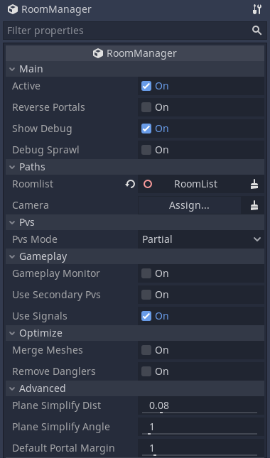
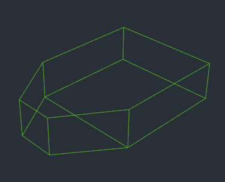
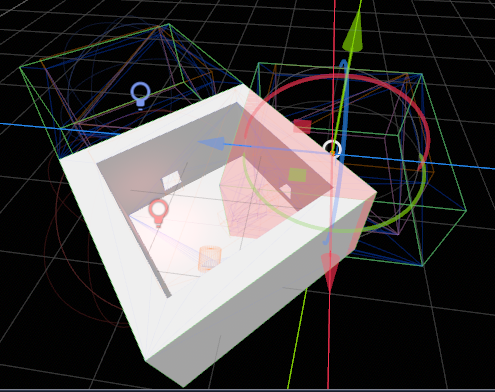
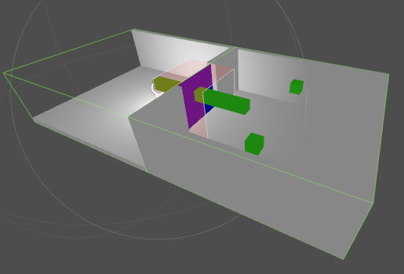
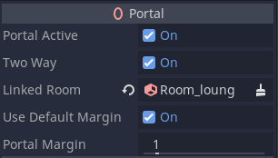
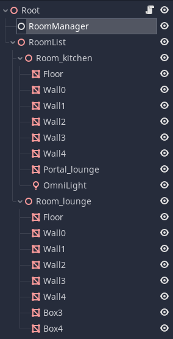

### Rooms and Portals
# The Basics
## Introduction
The rooms and portals system is an optional component of Godot that allows you to partition your 3D game levels into a series of `Room`s (_aka cells_), and `Portal`s which are openings between the rooms that the `Camera` can see through.

This allows several features:
* Portal occlusion culling, which can increase performance by reducing the number of objects that are drawn
* Gameplay callbacks, allowing turning off activity outside the gameplay area

The trade off for these features is that we have to manually partition our level into rooms, and add portals between them.

### And now a warning
Note that the portal system should be considered an _advanced feature_ of Godot. You should not attempt to use rooms and portals until you are familiar with the Godot editor, and have successfully made at least a couple of test games. It gives you great power as a game designer, but the trade off is it requires a more technical approach to level design than you may be accustomed to. It is aimed at producing professional quality results and assumes the user is prepared to put in the work for this. It is not intended to be used for all 3D games - not all will benefit, and it may require more time than a short game jam allows.

## The RoomManager
Anytime you want to use the portal system, you need to include a special node in your scene tree, called the `RoomManager`. The RoomManager is responsible for the runtime maintenance of the system, especially converting the objects in your rooms into a `room graph` which is used at runtime to perform occlusion culling and other tasks.

This conversion must take place every time you want to activate the system, it does not store the `room graph` in your project (for flexibility and to save memory). You can either trigger it by pressing the `convert rooms` button in the editor when the `RoomManager` is selected, or you can call the `rooms_convert` function in the `RoomManager`. This latter method will be what you use in game. Note that for safety, best practice is to call `rooms_clear` before unloading / changing levels.

If you convert the level while the editor is running, the portal culling system will take over from the normal Godot frustum culling. This may affect some editor features. For this reason, you can turn the portal culling on and off, using the `Active` setting in the `RoomManager`.

_Note: In order use the RoomManager you have to tell it where the Rooms are in your SceneTree, or rather where the 'RoomList' node is, that is, the parent of your Rooms - see below. If the RoomList is not set, conversion will fail, and you will see a warning dialog box._

## Rooms
### What is a room?
Rooms are a way of spatially partitioning your level into areas that make sense in terms of the level design. Rooms often quite literally *are* rooms (for instance in a building). Ultimately as far as the engine is concerned, a room respresents a __non-overlapping__ convex volume, in which you would typically place most of your objects that fall within that area.

A room doesn't need to correspond to a literal room. It could for example also be a canyon in an outdoor area, or a smaller part of a concave room. With a little imagination you can use the system in almost any scenario.

### Why convex?
The reason why rooms are defined as convex volumes (or 'convex hulls' as they are known), is that mathematically it is very easy to determine whether a point is within a convex hull. A simple plane check will tell you the distance of a point from a plane. If a point is behind all the planes bounding the convex hull, then by definition, it is inside the room. This makes all kinds of things easier in the internals of the system, like checking which room a `Camera` is within.

_A convex hull. The hull is defined as a series of planes facing outward. If a point is behind all the planes, it is within the hull._

### Why non-overlapping?
If two rooms overlap, and a camera or player is in this overlapping zone, then there is no way to tell which room the object should be in - and hence render from, or be rendered in. This requirement for non-overlapping rooms does have implications for level design.

If you accidentally create overlapping rooms, the editor will flag a warning when you convert the rooms, and indicate any overlapping zones in red.

The system does attempt to cope with overlapping rooms as best as possible by making the current room _'sticky'_. That is, each object remembers which room it was in last frame, and stays within it as long as it does not move outside the convex hull room bound. This can result in some hysteresis in these overlapping zones.

There is one exception however - _internal rooms_ (they are described later, you do not have to worry about these to start with).

### How do I create a room?
A Room is a node type that can be added to the scene tree like any other. You would then typically place objects within the room by making them children and grand-children of the Room node. Instead of placing the rooms as children of a Scene root node, you will need to create a Spatial especially for the job of being the parent of all the rooms. This node we will call the 'RoomList'. You will need to assign the roomlist node in the `RoomManager`, so the RoomManager knows where to find the rooms.

### Room naming convention
Unlike most nodes in Godot, a specific naming convention should be followed in order to identify each room. The name should have the prefix `Room_` followed by the name you wish to give the room, e.g. `Room_kitchen`, `Room_lounge`. If you don't follow these naming guidelines, the system will warn you and may not work correctly.

### How do I define the shape and position of my room convex hull?
Because defining the room bound is the most important aspect of the system, there are THREE methods available to define the shape of a room in Godot:
1) Use the geometry of the objects contained within the room to automatically create an approximate bound
2) Provide a manual bound - a MeshInstance in the room that has geometry in the shape of the desired bound, with a name prefixed by `Bound_`. This is something you may use if you create your levels in Blender or similar (_see the appendix for details of creating levels in Blender_).
3) By manually editing the points that define the convex hull, in the Room inspector.

While the first option can be all that is required, particularly with simple rooms, or for pre-production, the power of the manual bounds gives you ultimate control (at the expense of a small amount of editing). You can also combine the two approaches, perhaps using automatic bounds for most rooms but manually editing problem areas.

The automatic method is used whenever a manual bound is not supplied.

_A simple pair of rooms. The portal margin is shown with translucent red, and the room hulls are shown with green wireframe._

## Portals
If you create some rooms, place objects within them, then convert the level in the editor, you will see the objects in the rooms appearing and showing as you move between rooms. There is one problem however! Although you can see the objects within the room that the camera is in, you can't see to any neighbouring rooms! For that we need portals.

`Portal`s are special convex polygons. You position over the openings between rooms, in order to allow the system to see between them. You can create a Portal node directly in the editor. The default portal has 4 points and behaves much like a `Plane` `MeshInstance`. You can add or remove points using the inspector. A Portal will require at least 3 points to work (in order to form a polygon rather than a point or line).

Portals only need to be placed in one of each pair of neighbouring rooms (the _'source room'_) - the system will automatically make them two way unless you choose otherwise in the Portal settings. The portal normal should face _outward_ from the source room. The front face should be visible from _outside_ the room. The editor gizmo indicates the direction the portal is facing with an arrow, and a different color for each face.

Like `Room`s, `Portal`s also follow a naming convention which is as follows:
* Prefix `Portal_`
* Optional : You can add a suffix of the room that the portal will lead to ('destination room'). E.g. `Portal_Kitchen`

The suffix is optional - in many cases the system can automatically detect the nearest room that you intended to link to and do this for you. It is usually only in problem areas you will need to use the suffix.

In rare cases you may end up with two or more portals that you want to give the same name, because they lead into the same destination room. But Godot does not allow duplicate names! The solution to this is the wildcard character `*`. If you place a wildcard at the end of the name, the rest of the characters will be ignored. E.g. `Portal_Kitchen*1`, `Portal_Kitchen*2`.

All in all there are three ways of specifying which Room a Portal should link to:
* Leaving the name suffix blank to use auto-linking
* A suffix in the name
* Assigning the `Linked Room` in the inspector for a Portal node (this is simply a shortcut for setting the name)

### Portal restrictions
`Portal`s have some restrictions to work properly. They should be convex, and the polygon points should be in the same plane. The snapping of points to a plane is enforced because `Portal` points are only defined in 2D (with x and y coordinates) - the node transform is used to convert these to world space 3D points. The node transform thus determines the portal orientation.

## Trying it out
By now you should be able to create a couple of rooms, add some objects (regular `MeshInstance`s) within the rooms, and add portals between the rooms. Try converting the rooms in the editor, and see if you can now see the objects in neighbouring rooms, through the portals. Great success!

You have now mastered the basic principles of the system.

The next step is to look at the different types of objects that can be managed by the system.
