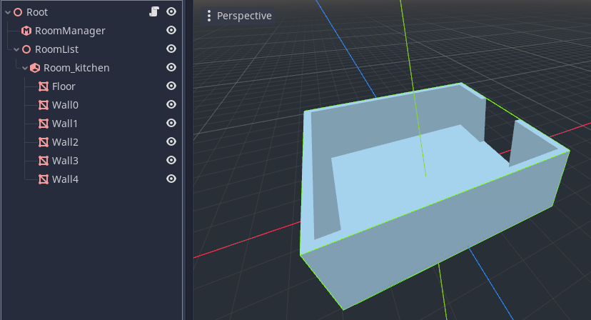

# Room and Portals - Tutorial Simple
[Back to Index](portals_index.md) \
[Download Tutorial Project](PortalDemo_Simple.zip)

## Introduction
This tutorial will introduce you to building a 'hello world' room system with two rooms, and a portal in between.

## Step 1

* Create a new project
* Add a `Spatial` as the scene root (I have called it 'Root')
* Next add a `RoomManager` node. We will need this later to process the room system.
* Next we need to start defining our rooms. We create all our rooms under another `Spatial` we have called 'RoomList'.
* Add a new `Room` node as a child of the roomlist.
* Give it a  name that starts with the prefix `Room_`. We add our chosen name as a suffix, here we have used 'kitchen'.
* We will now create the geometry of our room. The names you give to the geometry is up to you.
* Create a `MeshInstance` for the floor. Create a box mesh, and scale and position it to form a floor.
* Create `MeshInstance`s for the walls. Again use box meshes, and scale and position them, but be sure to leave an opening on one side (you will need to create two wall segments to do this on that side).
## Step 2

* Now we need to create the other room.
* You can do this simply by duplicating the first room (select the 'Room_kitchen' node, right click and choose 'duplicate').
* Rotate and position the second room so that the openings line up.
* Rename the second room to 'Room_lounge'.
## Step 3

* Next we will add a portal between the two rooms
* Create a new `Portal` in the kitchen, and call it `Portal_lounge`. The naming scheme tells the system which room it should link to.
* Scale and position the portal using the node Transform in the inspector, so it fits within the opening between the two rooms.
* The portal plane should face _outward_ from the source room, i.e. towards the lounge. This direction is indicated by the arrow in the editor gizmo, and the color of the portal.
## Step 4

* In order to make things more exciting, we want to add a few more boxes to the rooms.
* Placing these boxes as children / grand children of the room nodes explicitly tells the system which room the objects should be in. However, we can also create these objects _outside_ the rooms. Provided they are in the roomlist branch, the system will attempt to automatically place them in the correct room at runtime.
* I've placed these boxes as children of a `Spatial` I have called 'Freeform', just to keep our scene tree neat and tidy.
* I've also used a green material to make the boxes stand out more.
* Let's also place an `Omni` light so it will be autoplaced in one of the rooms.
## Step 5

* Next comes a crucial stage, we must let the `RoomManager` know where the rooms are!
* Select the `RoomManager` and look in the Inspector window in the 'Paths' section.
* You need to assign the 'RoomList' to point to the 'RoomList' node we created earlier (which is the parent of all the rooms).
## Step 6

* Make sure you have saved your project before this next step (it is always a good idea to save and make a backup before converting).
* Select the `RoomManager`, and you will see a button in the toolbar at the top of the 3d view called 'Convert Rooms'. Press this button.
* If all goes well, the `RoomManager` will have created the runtime data (the `room graph`) to do culling at runtime.
* You can see a log of the conversion process in the output window. This is helpful for finding problems.
* If you now move the editor camera inside the rooms, you should see the meshes in the opposite room being culled depending on what you can see through the portal.
## Conclusion
This concludes this simple tutorial. Don't be afraid to experiment with the new room system you have created.

#### Some things to try:
* Create different types of geometry - CSG nodes, Particle systems, Multimeshes
* Try creating a `Camera` and adding it to the scene. If you run the scene you will notice that the portal culling is not active. This is because the 'room graph' must be created each time you load a level, by converting the rooms. Instead of using a button in the editor, in real games you call a function in the `RoomManager` to convert the level, called `rooms_convert()`. Try this out with a script, perhaps running within a `_ready` function.
* The geometry you created so far is all `STATIC` (non-moving). If you look in the inspector for geometry nodes, you will see they derive from `CullInstance`. Here you can set the `portal_mode` for objects in the portal system. This determines how the node is processed.
* If you now write a script to move one of your objects within a room and view it through a `Camera` as the scene runs, you may notice that the object gets culled incorrectly. This is because `STATIC` objects are assumed not to move in the system. If you instead change the object to `DYNAMIC`, it should now update the culling correctly.
* There are several `portal_modes`, these are described in the main documentation.
* Try turning the portal on and off at runtime from your script! Once converted to a `Portal`, you can run `set_portal_active` to open and close the portal. 
