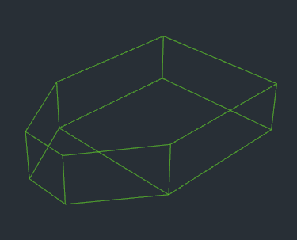
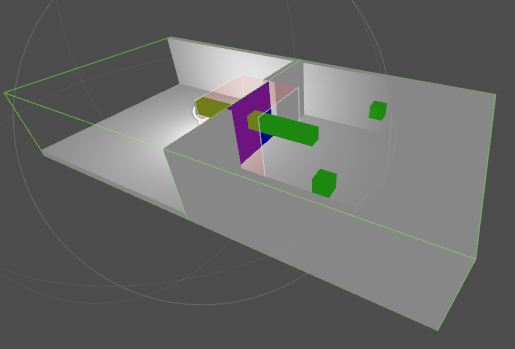
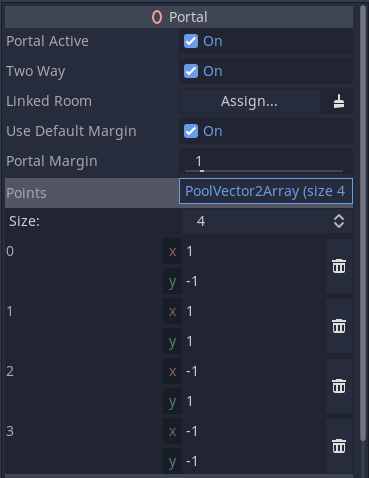
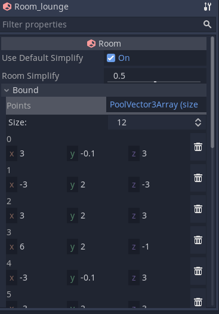

# Rooms and Portals
[Simple Tutorial](rooms_and_portals_tutorial_simple.md)

## Introduction
The rooms and portals system is an optional component of Godot that allows you to partition your game levels into a series of rooms (aka cells), and portals which are openings between the rooms that the camera can see through.

This allows several features:
* Portal occlusion culling, which can increase performance by reducing the number of objects that are drawn
* Gameplay callbacks, allowing turning off activity outside the gameplay area

The trade off for these features is that we have to manually partition our level into rooms, and add portals between them.

Note that some specific types of games may not offer many opportunities for occlusion culling, for example games with fixed top down view, or very small levels that do not stress the engine. However most other games with medium to large sized levels can benefit significantly, performance between 2-10x times faster is not uncommon, which can make the difference between a playable and unplayable game, especially on low power devices such as mobile.

# The Basics
## The RoomManager
Anytime you want to use the portal system, you need to include a special node in your scene tree, called the `RoomManager`. The RoomManager is responsible for the runtime maintenance of the system, especially converting the objects in your rooms into a `room graph` which is used at runtime to perform occlusion culling and other tasks.

This conversion must take place every time you want to activate the system, it does not store the `room graph` in your project (for flexibility and to save memory). You can either trigger it by pressing the `convert rooms` button in the editor when the `RoomManager` is selected, or you can call the `rooms_convert` function in the `RoomManager`. This latter method will be what you use in game. Note that for safety, best practice is to call `rooms_clear` before unloading / changing levels.

If you convert the level while the editor is running, the portal culling system will take over from the normal Godot frustum culling. This may affect some editor features. For this reason, you can turn the portal culling on and off, using the `Active` setting in the `RoomManager`.

_Note: In order use the RoomManager you have to tell it where the Rooms are in your SceneTree, or rather where the 'RoomList' node is, that is, the parent of your Rooms - see below. If the RoomList is not set, conversion will fail, and you will see a warning dialog box._


## Rooms
### What is a room?
Rooms are a way of spatially partitioning your level into areas that make sense in terms of the level design. Rooms often quite literally *are* rooms (for instance in a building). Ultimately as far as the engine is concerned, a room respresents a __non-overlapping__ convex volume, in which you would typically place most of your objects that fall within that area.

A room doesn't need to correspond to a literal room. It could for example also be a canyon in an outdoor area, or a smaller part of a concave room. With a little imagination you can use the system in almost any scenario.

### Why convex?
The reason why rooms are defined as convex volumes (or 'convex hulls' as they are known), is that mathematically it is very easy to determine whether a point is within a convex hull. A simple plane check will tell you the distance of a point from a plane. If a point is behind all the planes bounding the convex hull, then by definition, it is inside the room. This makes all kinds of things easier in the internals of the system, like checking which room a `Camera` is within.

_A convex hull. The hull is defined as a series of planes facing outward. If a point is behind all the planes, it is within the hull._


### Why non-overlapping?
If two rooms overlap, and a camera or player is in this overlapping zone, then there is no way to tell which room the object should be in - and hence render from, or be rendered in. This requirement for non-overlapping rooms does have implications for level design.

If you accidentally create overlapping rooms, the editor will flag a warning when you convert the rooms, and indicate any overlapping zones in red.

The system does attempt to cope with overlapping rooms as best as possible by making the current room _'sticky'_. That is, each object remembers which room it was in last frame, and stays within it as long as it does not move outside the convex hull room bound. This can result in some hysteresis in these overlapping zones.

There is one exception however - _internal rooms_ (they are described later, you do not have to worry about these to start with).

### How do I create a room?
A Room is a node type that can be added to the scene tree like any other. You would then typically place objects within the room by making them children and grand-children of the Room node. Instead of placing the rooms as children of a Scene root node, you will need to create a Spatial especially for the job of being the parent of all the rooms. This node we will call the 'RoomList'. You will need to assign the roomlist node in the `RoomManager`, so the RoomManager knows where to find the rooms.

There is actually another way of creating rooms. In order to allow users to build levels almost entirely within modeling programs such as Blender, rooms can start life as `Spatial`s (or `Empties` in blender). As long as you use a special naming convention, the `RoomManager` will automatically convert these Spatials to Rooms during the conversion phase.

The naming convention is as follows:
* Prefix `Room_`
* Suffix should be the name you choose to give the room, e.g. `Lounge`, `Kitchen` etc.

E.g. `Room_Lounge`.

### How do I define the shape and position of my convex hull?
Because defining the room bound is the most important aspect of the system, there are THREE methods available to define the shape of a room in Godot:
1) Use the geometry of the objects contained within the room to automatically create an approximate bound
2) Provide a manual bound - a MeshInstance in the room that has geometry in the shape of the desired bound, with a name prefixed by `Bound_`. This is something you may use if you create your levels in Blender or similar.
3) By manually editing the points that define the convex hull, in the Room inspector.

While the first option can be all that is required, particularly with simple rooms, or for pre-production, the power of the manual bounds gives you ultimate control (at the expense of a small amount of editing). You can also combine the two approaches, perhaps using automatic bounds for most rooms but manually editing problem areas.

The automatic method is used whenever a manual bound is not supplied.

_A simple pair of rooms. The portal margin is shown with translucent red, and the room hulls are shown with green wireframe._



## Portals
If you create some rooms, place objects within them, then convert the level in the editor, you will the objects in the rooms appearing and showing as you move between rooms. There is one problem however! Although you can see the objects within the room that the camera is in, you can't see to any neighbouring rooms! For that we need portals.

Portals are special convex polygons, that you position over openings between rooms to allow the system to see between them. You can create a Portal node directly in the editor, or like with rooms, you can create portals by first making a MeshInstance (e.g. in Blender), and using a special naming convention, and it will be converted to a Portal node during room conversion.

Portals only need to be placed in one of each pair of neighbouring rooms (the _'source room'_) - the system will automatically make them two way unless you choose otherwise in the Portal settings. The portal normal should face _outward_ from the source room. The front face should be visible from _outside_ the room. The editor gizmo indicates the direction the portal is facing with an arrow, and a different color for each face.


The naming convention for portals is as follows:
* Prefix `Portal_`
* Optional : You can add a suffix of the room that the portal will lead to ('destination room'). E.g. `Portal_Kitchen`

The suffix is optional - in many cases the system can automatically detect the nearest room that you intended to link to and do this for you. It is usually only in problem areas you will need to use the suffix.

In rare cases you may end up with two or more portals that you want to give the same name, because they lead into the same destination room. But Godot does not allow duplicate names! The solution to this is the wildcard character `*`. If you place a wildcard at the end of the name, the rest of the characters will be ignored. E.g. `Portal_Kitchen*1`, `Portal_Kitchen*2`.

All in all there are three ways of specifying which Room a Portal should link to:
* Leaving the name suffix blank to use auto-linking
* A suffix in the name
* Assigning the `Linked Room` in the inspector for a Portal node (this is simply a shortcut for setting the name)

### Portal restrictions
`Portal`s have some restrictions to work properly. They should be convex, and the polygon points should be in the same plane. The accuracy to the plane does not have to be exact, the system will automatically average the direction of the portal plane. Once converted to a `Portal` node, the snapping to the portal plane is enforced, and the vertices are specified (and editable) as 2d coordinates in the inspector, rather than 3d points. The orientation of the `Portal` is then defined by the transform of the `Portal` node.

When learning the system you are encouraged to create `Portal` nodes directly in the editor, which will behave in a similar manner to `Plane` `MeshInstance`s (unless you start editing the `Portal` points).

## Trying it out
By now you should be able to create a couple of rooms, add some objects (regular `MeshInstance`s) within the rooms, and add portals between the rooms. Try converting the rooms in the editor, and see if you can now see the objects in neighbouring rooms, through the portals. Great success!


You have now mastered the basic principles of the system.

The next step is to look at the different types of objects that can be managed by the system.

# Intermediate
## Portal mode
If you look in the inspector, every `VisualInstance` in Godot is derived from a `CullInstance`, where you can set a `PortalMode`. This determines how objects will behave in the portal system.


### STATIC
The default mode for objects is STATIC. Static objects are objects within rooms that will not move throughout the life of the level. Things like floors, walls, ceilings are good candidates for STATIC objects.
### DYNAMIC
Dynamic mode is for objects that are expected to move during the game. But there is a limitation - they must not move outside of their original room. These objects are handled very efficiently by the system. Examples might include moving platforms, and elevators.
### ROAMING
Roaming mode is for objects that can move between rooms. Things like players you will want to be roaming. These are more expensive to calculate than STATIC or DYNAMIC modes, because the system has to keep track of which room a roaming object is within.
### GLOBAL
Global mode is for objects that you don't want occlusion culled at all. Things like a main player's weapon, bullets and particle effects are good candidates for GLOBAL mode.
### IGNORE
Ignore is a special mode for objects that will be essentially free in the system. Manual bounds (`Bound_`) get converted to ignore portal mode automatically. They don't need to show up during the game, but are kept in the scene tree in case you need to convert the level multiple times (e.g. in the Editor). You might also choose to use this for objects that you only want to show up in the editor (when RoomManager is inactive).

### Should you place objects within rooms (in the scene tree) or not?
STATIC and DYNAMIC objects are ideally placed within rooms in the scene tree. The system needs to know which room they are in during conversion as it assumes they will never change room. Placing them within rooms in the scene tree allows you to explicitly tell the system where you want them.

### Autoplace
However, for ease of use, it is also possible to place STATIC and DYNAMIC objects _outside_ the rooms, but within the roomlist branch. The system will attempt to _autoplace_ the objects into the appropriate room. This works in most cases but if in doubt, use the explicit approach, especially when dealing with internal rooms, which have some restrictions for sprawling objects.

Note that if you place STATIC and DYNAMIC objects outside of rooms, they will not contribute to the room bound. So if you are using the room geometry to derive the bound, tables and chairs can be placed outside the room, but walls and floors should be explicitly within the Room branch of the scene tree, in order to ensure the bound is correct.

ROAMING and GLOBAL objects you are recommended to maintain in a branch of the scene tree outside of any rooms or the roomlist (their _can_ be placed inside the rooms, but to save confusion they are normally better kept on their own branch). There are no restrictions on the placement of IGNORE objects.

### Object Lifetimes
At the time of writing, the lifetime of STATIC and DYNAMIC objects is tied to the lifetime of the level, between when you call `rooms_convert` to activate the portal system, and calling `rooms_clear` to unload the system. You should therefore not try to create or delete STATIC or DYNAMIC objects while the portal system is active. Doing so will cause the system to automatically unload because it is in an invalid state. You can however, freely `show` and `hide` these objects.

The sequence should be therefore:
* Load your level
* Place any STATIC or DYNAMIC objects
* Then run `rooms_convert`.

Other objects can be created and deleted as required.

## Sprawling
Although users can usually ignore the internals of the portal system, they should be aware that it is capable of handling objects that are so big they end up in more than one room. Each object has a central room, but using the AABB or geometry the system can detect when an object extends across a portal into a neighbouring room / rooms. This is called `Sprawling`.

This means that if the corner of an object is showing in a neighbouring room, but the object's main room is not showing (e.g. a train where the end is in a different room), the object will not be culled. The object will only be culled if it is not present in any of the rooms that are visible.

### Portal Margins
It is hard to place objects exactly at the edges of rooms, and if we chose to sprawl objects to the adjacent room the moment a portal was crossed (even by a minute amount), there would be an unnecessary amount of sprawling, and more objects would be rendered than we need. To counter this, portals have an adjustable leeway, called a `margin` over which an object can cross without being considered in the next room. The margin is shown in the editor gizmo as a red translucent area.

You can set the margin globally in the `RoomManager`, and you can override this margin value in any `Portal` if you need to fine tune things. As you edit the margin values in the Inspector, you should see the margins change in the 3d window.

### Include in Bound
The support for objects that are larger than a single room has one side effect - you may not want to include some objects in the calculation of the automatic room bound. You can turn this off in the inspector - `CullInstance/IncludeInBound`.

While this works great for large moving objects, it also has the side effect of allowing you a lot more leeway in level design. You can for instance create a large terrain section and have it present in multiple rooms, without splitting up the mesh.

## Lighting
In general lights are handled like other objects. They can be placed in rooms, and they will sprawl to affect neighbouring rooms, according to the dimensions of the light. The exception to this is DirectionalLights. DirectionalLights have no source room as they affect _everywhere_. They should therefore not be placed in a `Room`. As DirectionalLights can be expensive, it is a good idea to turn them off when inside, see the `RoomGroup`s section below for more details on how to do this.

Congratulations! You have now mastered the basic techniques required to use rooms and portals. You can use these to make games already, but there are many more features.

# Advanced
## Gameplay Callbacks
Although occlusion culling greatly reduces the number of objects that need to be rendered, there are other costs to maintaining objects in a game besides the final rendering. For instance, did you know that in Godot, animated objects will still be animated whether they appear on screen or not! This can take up a lot of processing power, especially for objects that use software skinning (where skinning is calculated on the CPU).

Fear not, rooms and portals can solve these problems, and more.

By building our system of rooms for our game level, not only do we have the information needed for occlusion culling, we also have handily created the information required to know which rooms are in the local 'gameplay area' of the player (or camera). If you think about it, in a lot of cases, there is no need to do a lot of simulation on objects that have nothing to do with gameplay.

The gameplay area is not confined to just the objects you can see in front of you. AI monsters behind you still need to attack you when your back is turned! In Godot the gameplay area is defined as the `potentially visible set` (PVS) of rooms, from the room you are currently within. That is, if there is any part of a room that can possibly be viewed from any part of the room you are in (even from a corner), it is considered within the PVS, and hence the gameplay area.

This works because if a monster is in an area that is completely out of view for yourself or the monster, you are less likely to care what it is doing.

### How does a monster know whether it is within the gameplay area?
This problem is solved because the portal system contains a subsystem called the `gameplay monitor` that can be turned on and off from the `RoomManager`. When switched on, any roaming objects that move inside or outside the gameplay area (whether by moving themselves, or the player moving) will receive callbacks to let them know of this change.

You can choose to either receive these callbacks as `signals`, or as `notifications`.

Notifications can be handled e.g. in gdscript:
```
func _notification(what):
	match what:
		NOTIFICATION_ENTER_GAMEPLAY:
			print("notification enter gameplay")
		NOTIFICATION_EXIT_GAMEPLAY:
			print("notification exit gameplay")
```

Signals are sent just as any other signal, they can be attached to functions using the Editor Inspector. The signals are called `gameplay_entered` and `gameplay_exited`.

In fact, you don't just receive these callbacks for ROAMING objects. In addition Rooms and RoomGroups (which can be used to form groups of rooms) can also receive callbacks. You can use this to e.g. trigger AI behaviour when the player reaches certain points in a level. There are no rules, it is up to you.

## VisbilityNotifiers / VisibilityEnablers
Gameplay callbacks have one more useful function. By default in Godot animation and physics are still processed regardless of whether an object is within view. This can sap performance, especially when using software skinning.

The engine's solution to this problem is the `VisibilityNotifier` node, and its slightly easier to use variation, the `VisibilityEnabler` node. `VisibilityEnabler` can be used to switch off animation and sleep physics when an object is outside the view frustum. You do this by simply placing a `VisibilityEnabler` node in your subscene (for e.g. a monster). It will do the rest. Consult the `VisibilityEnabler` documentation for full details.

What if the `VisibilityEnabler` could turn off objects when they were occlusion culled? Well it turns out they can. All you have to do is switch on the `Gameplay Monitor` and the rest happens automatically.

## RoomGroups
A `RoomGroup` is a special node which allows you to deal with a group of `Rooms`s at once, instead of having write code for them individually. This is especially useful in conjunction with gameplay callbacks. The most important use for `RoomGroup`s is to delineate between 'inside' and 'outside' areas.


For instance, when outside you may wish to use a directional light to represent the sun. When the outside `RoomGroup` receives an enter gameplay callback, you can turn the light on, and you can turn it off when the `RoomGroup` exits gameplay. With the light off, performance will increase as there is no need to render it indoors.

This is an example of a simple `RoomGroup` script to turn on and off a `DirectionalLight` (note that you can also use signals for callbacks, the choice is up to you) :


You can apply the same technique for switching on and off rain effects, skyboxes and much more.

## Internal Rooms
There is one more trick that RoomGroups have up their sleeve. A very common desire is to have a game level with a mixed outdoor and indoor environment. We have already mentioned that Rooms can be used to represent both rooms in a building, and areas of landscape, such as a canyon.

What happens if you wish to have a house in a terrain 'room'?

With the functionality described so far you _can_ do it, you would need to place portals around the exterior of the house though, forming needless rooms above the house. This has been done in many games. But what if there was a simpler way?

It turns out there is a simpler way of handling this scenario. Godot supports rooms WITHIN rooms (we will call them 'internal rooms'). That is, you can place a house within a terrain room, or even a building, or set of buildings, and even have exit portals in different terrain rooms!

This is actually very simple to do. You don't need to place a room within another room in the scene tree (in fact you will get a warning if you try this). Instead, just create them as regular rooms. But the internal rooms should be grouped together with a `RoomGroup` as parent. If you look in the inspector for the `RoomGroup` there is a `roomgroup_priority` which defaults to 0.

If you want a room or set of rooms to be internal, just set the priority to a higher value than the outer (enclosing) room, using the `RoomGroup`. That's all there is to it.

The system uses the priority to give priority to the internal room when deciding which room a camera or object is within. Everything else works in a mostly similar way.

The only differences:
* Portals between internal rooms and outer rooms should always __be placed in the inner (internal) room__
* Portals of internal rooms are not considered as part of the bound of outer rooms
* STATIC and DYNAMIC Objects from outer rooms will not sprawl into internal rooms. If you want objects to cross these portals, place them in the internal room. This is to prevent large objects like terrain sections sprawling into entire buildings, and rendering when not necessary.

# Appendix
## Portal Point Editing
Portals are defined by a combination of the transform of the Portal node, and by a set of points which form the corners.

The default portal has 4 corners as shown in the inspector:



You can edit these points in the inspector to make a better match to the opening in your game level. But bear in mind it generally better to keep the number of points as low as possible for the efficiency of the system. It is better to risk rendering a little too much than to spend the time culling objects at 20 different edges, for example.

## Room Point Editing
You also have the option to manually edit the points used to define the convex hull of a `Room`. These points are not present by default, you would typically create them by pressing the `Generate Points` button in the editor, when a Room is selected. This will transfer the auto bound from the geometry (or manual `Bound_` mesh) into the inspector. Once there are points in the inspector, they will be used and override any other method. So if you wish to revert your manual editing, simply delete all the points.



Manually editing rooms points is more difficult than editing portal points, but it can be useful in some situations, especially where the auto-bound doesn't _quite_ get the right result you want. It is usually a good idea to use a lot of `simplification` in the inspector for the Room before generating the points (be aware though that by default, the `simplification` value will be inherited from the `RoomManager`).

## RoomManager
#### Show Debug
This can be used to turn on and off display of portals in the editor, and control the amount of logging. Debug will always be set to false on exported projects.
#### Debug Sprawl
This mode will only display meshes that are sprawling through portals from the current camera room. Large statics that cross portals are usually the ones you want to sprawl. Typical examples might be terrain mesh areas, or large floor or ceiling meshes. You usually don't want things like door frames to sprawl to the adjacent room - that is what fine tuning the `Portal margin` is for.
#### Merge Meshes
In order to keep drawcalls to a minimum, the system offers the option to automatically merge similar meshes within a room. This can increase performance in many cases. The culling accuracy is reduced, but as a room is a fairly logical unit for culling, this trade off usually works in your favour.
#### Plane Simplification
In some cases, automatically generated convex hull bounds may contain a very large number of planes. This is not ideal because it slows down determining which room a camera or object is within. The system can optionally simplify hulls. The degree of simplification can be selected by the user, between 0 (no simplification) and 1 (maximum simplification). You can also override this value in individual rooms.

## Portals
#### Portal Active
Portals can be turned on and off at runtime. This is especially useful if you have open and closing doors.
#### Two Way
Portals can either be two way or one way. One way portals may be useful for example to create windows that can be seen out of, but not seen into. This can help performance when viewing buildings from outdoors.

### Particle Systems
Be aware that when placing STATIC particle systems, the AABB on conversion may have zero size. This means the particle system may be unexpectedly culled early. To prevent this, either set the particle system `portal mode` to DYNAMIC, or alternatively, add an `extra cull margin` to the particle system in the Geometry Inspector.

### Multimeshes
Note that multimeshes will be culled as a group, rather than individually. You should therefore attempt to keep them localised to the same area wherever possible.
