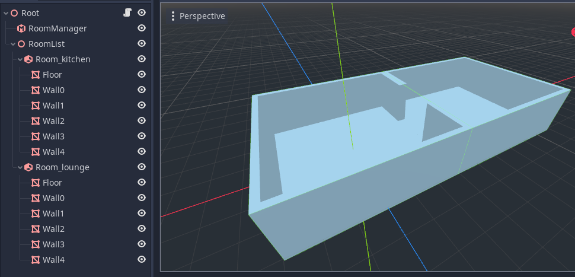
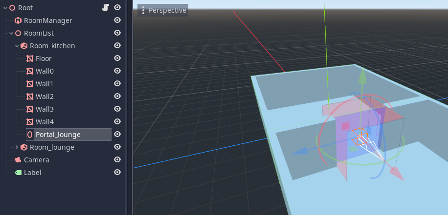

# Room and Portals - Tutorial Simple
## Introduction
This tutorial will introduce you to building a 'hello world' room system with two rooms, and a portal in between.

## Step 1

* Create a new project
* Add a `Spatial` as the scene root (I have called it 'Root')
* Next add a `RoomManager` node. We will need this later to process the room system.
* Next we need to start defining our rooms. We create all our rooms under another `Spatial` we have called 'RoomList'.
* We can, but don't need to create rooms as `Room` nodes directly. Here the indirect method is used - the room is simply a `Spatial` with a name that starts with the prefix `Room_`. We add our chosen name as a suffix, here we have used 'kitchen'.
* We will now create the geometry of our room. The names you give to the geometry is up to you.
* Create a `MeshInstance` for the floor. Create a box mesh, and scale and position it to form a floor.
* Create `MeshInstance`s for the walls. Again use box meshes, and scale and position them, but be sure to leave an opening on one side (you will need to create two wall segments to do this on that side).
## Step 2

* Now we need to create the other room.
* You can do this simply by duplicating the first room (select the 'Room_kitchen' node, right click and choose 'duplicate').
* Rotate and position the second room so that the openings line up.
* Rename the second room to 'Room_lounge'.

## Step 3

